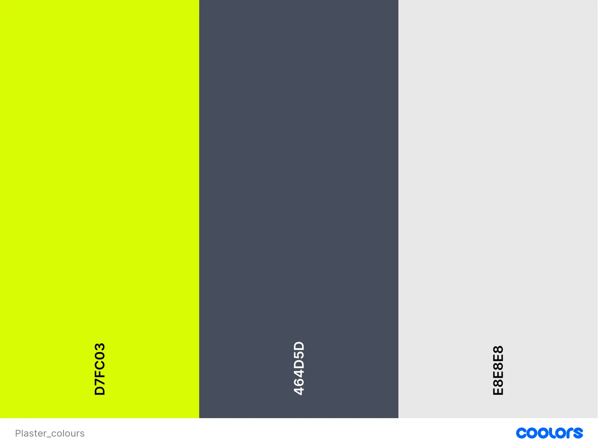

# Plasterer

Visit the deployed site: [Plasterer](https://2ndborn.github.io/plasterer/)
## Mission statement
This website is for the owner who works in the construction trade to showcase his works and attract new business.
## User Stories
### `Navigation`
 I want to navigate between the different sections of the website, so I can get the information that I need.
___
### `About Me`
* I want to read a short bio about the owner so that I can learn a bit about them.
___
### `Services`
-   I want to view a list of the services that the owner offers , so I can identify whether they provide the service I am looking for.
-   I want to view some of the owners works, so I can verify their expertises.
___
### `Contact`
* I want to view links to the phone number, so I have the means to contact them.
## Future Features
The owner has plans to improve his skills with email. When that time comes we can at his email details to the site
## Colour & Typography
### `Colour`
||Fonts|CTA Buttons|Cards|Body|
|-|-|-|-|-|
|Lime Yellow - #d7fc03|-|✅|-|-|
|Charcoal Blue - #464D5D|-|-|✅|-|
|Alabaster Grey - #e8e8e8|✅|-|-|✅|



### `Fonts`
||h1, h2 tags|Rest|
|-|-|-|
|Noto serif|✅|-|
|Noto sans|-|✅|
## Wireframes
| Mobile | Tablet | Desktop |
|---|---|---|
|Click [here](../egbert/readme-assets/assets/plaster_wireframe.webp) to view image.|Click [here](../egbert/readme-assets/assets/plaster_tablet.webp) to view image.|Click [here](../egbert/readme-assets/assets/plaster_desktop.webp) to view image.|
## Technologies
### `Resources`
* HTML
* CSS
* Javascript
* VSCode
* [Vite](https://vite.dev/)
* [React Icons](https://react-icons.github.io/react-icons/)
* [Motion — JavaScript & React animation library](https://motion.dev/)
* Microsoft Copilot
* [Google Fonts](https://fonts.google.com/)
* [JPG Converter | CloudConvert](https://cloudconvert.com/jpg-converter)
* [Min-Max-Value Interpolation](https://min-max-calculator.9elements.com/?16,24,320,1200)
* [CSS Gradient Generator - W3Schools](https://www.w3schools.com/tools/tool_css_gradient.php#gsc.tab=0&gsc.q=preserve%203d)
* [The W3C Markup Validation Service](https://validator.w3.org/)
* [gh-pages - npm](https://www.npmjs.com/package/gh-pages)
## Fixed bugs

### Mobile Viewport Jolt Fix (with AI Assistance)
On mobile devices (Android + iOS), the hero section would “jump” when the user started scrolling.

This wasn’t caused by animations or layout, it was due to mobile browsers dynamically resizing the viewport when their UI bars collapse.

With the help of AI debugging, the issue was traced to the use of `100vh`/`100dvh`, which change during scroll on mobile and cause a visible jolt.
#### **Fix**
The hero height was updated to use the new CSS viewport unit:

```css
height: 100svh;

```
`100svh` represents the **smallest stable viewport height**, which does not change when the browser UI collapses.  
This prevents the hero from resizing during scroll and removes the jolt entirely.

---

### Overlay Z‑Index Stacking Fix (with AI Assistance)

The overlay modal was appearing _behind_  the `Next.jsx`  section instead of above it.  This wasn’t caused by animations or layout it was due to stacking contexts created by positioned elements lower in the page.

With the help of AI debugging, the issue was traced to the overlay container missing a `z-index`.  Because the overlay used `position: fixed`  without a stacking value, it was being placed underneath other components that implicitly created higher stacking layers.

#### **Fix**

A high `z-index`  was added to the overlay wrapper:


```css
zIndex: 9999999;

```

This forces the overlay to sit at the top of the stacking order, ensuring it always appears above all page content.  The modal now renders correctly, the blurred backdrop displays as intended, and all overlay interactions work reliably.
## TESTING
Please click [here](../egbert/TESTING.md) to view application testing.
## LOCAL DEVELOPMENT
### Clone Repository
1. Login/Sign up to [GitHub](https://github.com/)
2. Go to the project repository [GitHub - 2ndborn/plasterer](https://github.com/2ndborn/plasterer)
3. Click on the green code button, select whether you would like to clone with **HTTPS**, SSH or GitHub CLI and copy the link shown.
4. Open the terminal in your code editor and change the current working directory to the location you want to use for the cloned directory. ls (list the files and folder) cd <name of location/directory>(change directory)
5. Type the following command in the terminal (after the git clone you will need to paste the link you copied in step 3 above):
6. Install Vite: <div style="background:#f6f8fa; padding:1em; border-radius:6px;">
	  <pre><code>
	  npm create vite@latest
	  </code></pre>
	</div>
7. Pick a project name: egbert
8. Select a variable: For this project pick JavaScript + SWC
9. Lauch the React app in the browser: <div style="background:#f6f8fa; padding:1em; border-radius:6px;">
	  <pre><code>
		cd egbert
		npm run dev
	  </code></pre>
	</div>
10. You should see the following: <div style="background:#f6f8fa; padding:1em; border-radius:6px;">
	  <pre><code>
	  ➜ Local: http://localhost:5173/ 
	  ➜ Network: use --host to expose 
	  ➜ press h + enter to show help
	  *Click the Local: link to open the browswer*
	  </code></pre>
	</div>
## Deployment
Deployment is slightly different because of the use of the React Framework. 
#### 1. **Install the** `gh-pages` **package**
This package handles publishing the Vite build output to a dedicated `gh-pages` branch.
<div style="background:#f6f8fa; padding:1em; border-radius:6px;">
<pre><code>npm install gh-pages --save-dev</code></pre>
</div>

#### 2. **Add the** `homepage` **field to** `package.json`

This ensures Vite builds assets with the correct absolute paths for GitHub Pages.
<div style="background:#f6f8fa; padding:1em; border-radius:6px;">
<pre><code>"homepage": "https://2ndborn.github.io/plasterer/"
</code></pre>
</div>

#### **3. Add deploy scripts to** `package.json`

These scripts build the project and publish the `dist` folder to the `gh-pages` branch.
<div style="background:#f6f8fa; padding:1em; border-radius:6px;">
<pre><code>"predeploy": "npm run build",
"deploy": "gh-pages -d dist"
</code></pre>
</div>

#### **4. Configure Vite with the correct base path**

GitHub Pages serves the project from a sub‑directory, so Vite must know the repo name.

In `vite.config.js`:
<div style="background:#f6f8fa; padding:1em; border-radius:6px;">
<pre><code>export default defineConfig({
  plugins: [react()],
  base: '/plasterer/'
})
</code></pre>
</div>

#### **5. Add a** `404.html` **redirect for GitHub Pages**

GitHub Pages does not support SPA routing. To prevent refresh/navigation 404s, add this file:

`public/404.html`
```
<!DOCTYPE html>
<html>
	<head>
		<meta http-equiv="refresh" content="0; url=/" />
	</head>
	<body></body>
</html>
```

#### 6. Paste publish script in package.json

<div  style="background:#f6f8fa; padding:1em; border-radius:6px;">
	<pre><code>"publish": "npm run build && npm run deploy"</code></pre>
</div>

#### 7. Deploy the site

<div  style="background:#f6f8fa; padding:1em; border-radius:6px;">
	<pre><code>npm run publish</code></pre>
</div>

#### 8. Configure GitHub Pages
In the repository:

**Settings → Pages**

-   **Source:** `Deploy from a branch`
-   **Branch:** `gh-pages`
-   **Folder:** `/root`
    
Save the settings.

#### 9. Main.jsx 

Add this to main.jsx:
#### 9. Main.jsx 

Add this to main.jsx:
```
import { Fragment, StrictMode } from 'react'
import { createRoot } from 'react-dom/client'
import './index.css'
import App from './App.jsx'

const isDev = import.meta.env.DEV;
const AppWrapper = isDev ? StrictMode : Fragment; 

createRoot(document.getElementById('root')).render(
<AppWrapper>
    <Router>
      <App />
    </Router>
  </AppWrapper>,
)
```

#### 10. Access the live site
<div style="background:#f6f8fa; padding:1em; border-radius:6px;">
<pre><code>https://2ndborn.github.io/plasterer/
</code></pre>
</div>