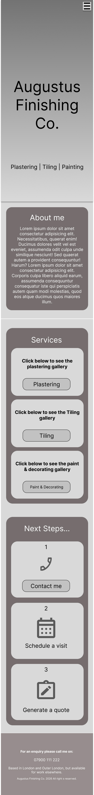

# Plasterer
## Mission statement
This website is for the owner who works in the construction trade to showcase his works and attract new business.
## User Stories
### `Navigation`
 I want to navigate between the different sections of the website, so I can get the information that I need.
___
### `About Me`
* I want to read a short bio about the owner so that I can learn a bit about them.
___
### `Services`
-   I want to view a list of the services that the owner offers , so I can identify whether they provide the service I am looking for.
-   I want to view some of the owners works, so I can verify their expertises.
___
### `Contact`
* I want to view links to the phone number, so I have the means to contact them.
## Future Features
The owner has plans to improve his skills with email. When that time comes we can at his email details to the site
## Colour & Typography
### `Colour`
||Fonts|CTA Buttons|Cards|Body|
|-|-|-|-|-|
|Lime Yellow - #d7fc03|-|✅|-|-|
|Charcoal Blue - #464D5D|-|-|✅|-|
|Alabaster Grey - #e8e8e8|✅|-|-|✅|

[Colours](../egbert/readme-assets/assets/Plaster_colours.webp)

### `Fonts`
||h1, h2 tags|Rest|
|-|-|-|
|Noto serif|✅|-|
|Noto sans|-|✅|
## Wireframes
| Mobile | About me | Portfolio |
|---|---|---|
||-|-|
## Technologies
### `Resources`
* HTML
* CSS
* Javascript
* VSCode
* [Vite](https://vite.dev/)
* [React Icons](https://react-icons.github.io/react-icons/)
* [Motion — JavaScript & React animation library](https://motion.dev/)
* Microsoft Copilot
* [Google Fonts](https://fonts.google.com/)
* [JPG Converter | CloudConvert](https://cloudconvert.com/jpg-converter)
* [Min-Max-Value Interpolation](https://min-max-calculator.9elements.com/?16,24,320,1200)
* [CSS Gradient Generator - W3Schools](https://www.w3schools.com/tools/tool_css_gradient.php#gsc.tab=0&gsc.q=preserve%203d)
* [The W3C Markup Validation Service](https://validator.w3.org/)
* [JSHint, a JavaScript Code Quality Tool](https://jshint.com/)
* [gh-pages - npm](https://www.npmjs.com/package/gh-pages)
## Fixed bugs
### Gallery Modal underneath one of the sections
### Overlay utility crashing the render
## TESTING
Please click [here](../egbert/TESTING.md) to view application testing.
## LOCAL DEVELOPMENT
### Clone Repository
1. Login/Sign up to [GitHub]([GitHub](https://github.com/)
2. Go to the project repository [GitHub - 2ndborn/plasterer](https://github.com/2ndborn/plasterer)
3. Click on the green code button, select whether you would like to clone with **HTTPS**, SSH or GitHub CLI and copy the link shown.
4. Open the terminal in your code editor and change the current working directory to the location you want to use for the cloned directory. ls (list the files and folder) cd <name of location/directory>(change directory)
5. Type the following command in the terminal (after the git clone you will need to paste the link you copied in step 3 above):
6. Install Vite: 

	  <pre><code>
	  npm create vite@latest
	  </code></pre>
	

7. Pick a project name: egbert
8. Select a variable: For this project pick JavaScript + SWC
9. Lauch the React app in the browser: 

	  <pre><code>
		cd egbert
		npm run dev
	  </code></pre>
	

10. You should see the following: 

	  <pre><code>
	  ➜ Local: http://localhost:5173/ 
	  ➜ Network: use --host to expose 
	  ➜ press h + enter to show help
	  *Click the Local: link to open the browswer*
	  </code></pre>
	

## Deployment
Deployment is slightly different because of the use of the React Framework. 
#### 1. **Install the** `gh-pages` **package**
This package handles publishing the Vite build output to a dedicated `gh-pages` branch.

<pre><code>npm install gh-pages --save-dev</code></pre>

#### 2. **Add the** `homepage` **field to** `package.json`

This ensures Vite builds assets with the correct absolute paths for GitHub Pages.

<pre><code>"homepage": "https://2ndborn.github.io/micah-francis.com"
</code></pre>

#### **3. Add deploy scripts to** `package.json`

These scripts build the project and publish the `dist` folder to the `gh-pages` branch.

<pre><code>"predeploy": "npm run build",
"deploy": "gh-pages -d dist"
</code></pre>

#### **4. Configure Vite with the correct base path**

GitHub Pages serves the project from a sub‑directory, so Vite must know the repo name.

In `vite.config.js`:

<pre><code>export default defineConfig({
  plugins: [react()],
  base: '/micah-francis.com/'
})
</code></pre>

#### **5. Add a** `404.html` **redirect for GitHub Pages**

GitHub Pages does not support SPA routing. To prevent refresh/navigation 404s, add this file:

`public/404.html`

<pre><code>!DOCTYPE html>
html> 
	head>
	    meta http-equiv="refresh" content="0; url=/" />
	/head>
	body>/body>
/html>
</code></pre>

#### **6. Switch React Router to** `HashRouter`

GitHub Pages cannot handle BrowserRouter’s history API. HashRouter ensures routing works without server rewrites.

<pre><code>import { HashRouter as Router } from "react-router-dom";</code></pre>

<pre><code>Router>
	App />
/Router></code></pre>

#### 7. Deploy the site

<pre><code>npm run deploy
</code></pre>

#### 8. Configure GitHub Pages
In the repository:

**Settings → Pages**

-   **Source:** `Deploy from a branch`
-   **Branch:** `gh-pages`
-   **Folder:** `/root`
    
Save the settings.

#### 9. Access the live site

<pre><code>https://2ndborn.github.io/micah-francis.com/
</code></pre>

