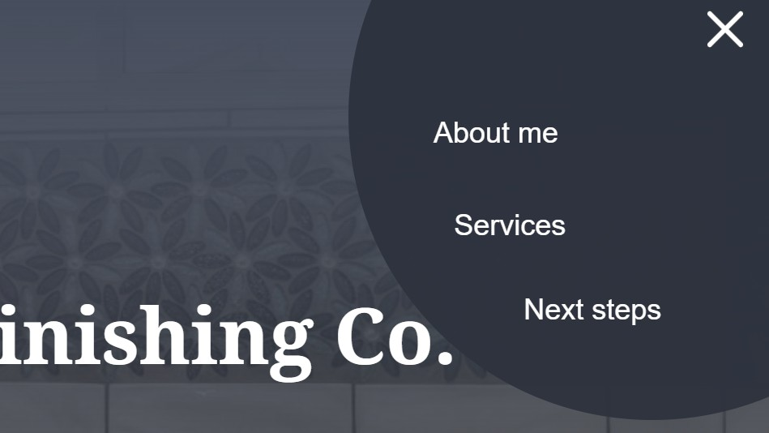
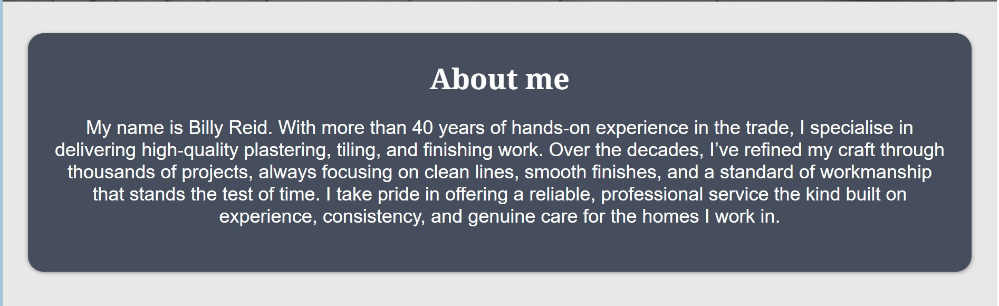
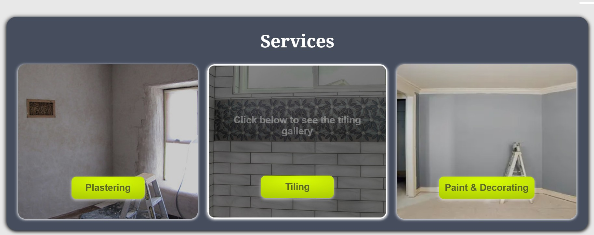
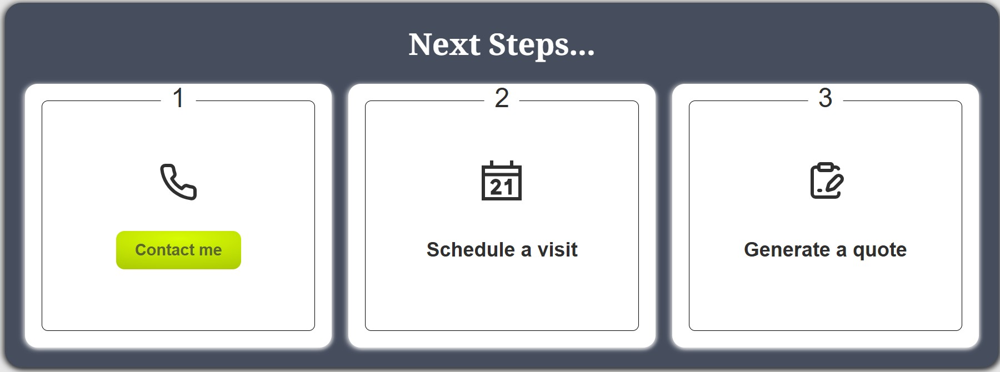
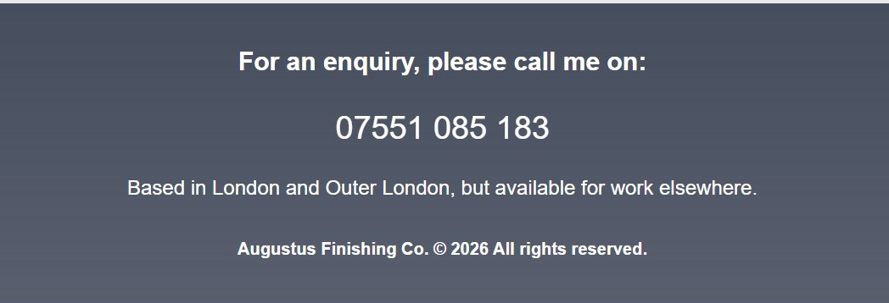

# Plasterer Testing
Visit the deployed site: [Plasterer](https://2ndborn.github.io/plasterer/)

---

## CONTENTS

* [AUTOMATED TESTING](#automated-testing)

* [W3C Validator](#w3c-validator) for CSS

* ESLint is installed as a JavaScript Validator

* [MANUAL TESTING](#manual-testing)

* [Testing User Stories](#testing-user-stories)

* [Full Testing](#full-testing)

---

## AUTOMATED TESTING

### W3C Validator

[W3C](https://validator.w3.org/) was used to validate the HTML on all pages of the website. It was also used to validate the CSS.

* [App.css](../egbert/readme-assets/assets/apps_css.jpg)
* [Home.module.css](../egbert/readme-assets/assets/home_css.jpg)
* [Services.module.css](../egbert/readme-assets/assets/service_css.jpg)
* [Next.module.css](../egbert/readme-assets/assets/next_css.jpg)
* [NavBar.module.css](../egbert/readme-assets/assets/navbar_css.jpg)
- - -
### **Performance & Accessibility Testing**
This project was evaluated using **Google Lighthouse** to ensure strong performance, accessibility, best practices, and SEO. The site achieved high scores across all categories, confirming that it is fast, accessible, and built following modern web standards.

## MANUAL TESTING

### Testing User Stories

`Navigation`

| Goals | How are they achieved? | Evidence |
| :--- | :--- | :--- |
| I want to navigate between the different sections of the website, so I can get the information that I need. | The hamburger menu reveal options to smooth scroll to each section. |  |

`About me`

| Goal | How is this achieved | Evidence |
| --- | --- | --- |
|I want to read a short bio about the owner so that I can learn a bit about them.|Users can down to the About me section to read a short bio about the owner.||

`Services`

| Goal | How is this achieved | Evidence |
| --- | --- | --- |
|I want to view a list of the services that the owner offers , so I can identify whether they provide the service I am looking for.|In the Services section users can see the owner offers a Plastering, Tiling and Paint & Decorating services.||
| I want to view some of the owners works, so I can verify their expertises.|Users can click a Plasterer, Tiling and Paint & Decorating buttons to view a Modal containing images of the owners work.||

`Next steps`

| Goal | How is this achieved | Evidence |
| --- | --- | --- |
|I want to view a set of intructions informing me of the next steps to take so I know how to engage with the owner.|User can scroll down to the Next steps section.||

`Contact me`

| Goal | How is this achieved | Evidence |
| --- | --- | --- |
|I want to view links to the phone number, so I have the means to contact them.|Users can scroll down to the bottom of the page and see the owners mobile number in the footer.||

`General`

| Goal | How is this achieved | Evidence |
| --- | --- | --- |
| I want the app to function across multiple devices, so that I can access and use it without restrictions regardless of the device I'm on.|Users can access the site on multiply devices.||

- - -

### Full Testing
Full testing was performed on the following devices:

* Laptop:
	* MSI Summit 13 AI+ Evo A2VMTG
	* HP
	* Google Chromebook

* Mobile Devices:
	* iPhone 13 pro
	* Google Pixel 6 Pro
	* Google Pixel 9a
	* Motorola g 06
____
Devices tested the site using the following browsers:

* Google Chrome
* Edge
* Firefox
* Opera
---
### Additional Testing 
Additional testing was taken by friends and family on a variety of devices and screen sizes.

| Feature | Expected Outcome | Testing Performed | Result | Pass/Fail |
| --- | --- | --- | --- | --- |
|**`Navbar`**|
| About Me | When clicked, the user is taken to the About Me section| Clicked the About Me button | smooth scrolled to the About Me section| ✅ |
| Services | When clicked, the user is taken to the Services section | Clicked the Services button | smooth scrolled to the Services section| ✅ |
| Next steps| When clicked, the user is taken to the Next steps section | Clicked the Next steps button | smooth scrolled to the Next steps section| ✅ |
| Hover effect on nav items | When hovering over a nav item, it changes colour | Hovered over nav items | Items changed to **#b7b7b7** | ✅ |
| --- | --- | --- | --- | --- |
|**`Services Page`**|
| Services buttons | When the Plasterer, Tiling and Paint & Decorating button is clicked it opens a modal with a gallery unique to each title.|Clicked the Plasterer, Tiling and Paint & Decorating buttons | A modal opened with a galley unique to each title.| ✅ |
| Modal buttons | The **`<`** and **`>`** toggle the gallery backwards and forwards.|Clicked the **`<`** and **`>`** buttons | Toggled the gallery backwards and forwards.| ✅ |
| --- | --- | --- | --- | --- |
|**`Next steps`**|
| Contact me button (mobile) | When the Contact me button is clicked it opens the phone app on a mobile.|Clicked the button on a mobile device 600px. | The phone app is opened| ✅ |
| Contact me button (Tablet/Desktop) | When the Contact me button is clicked scrolls down to the footer section.|Clicked the button on desktop and tablet device. | The user is transferred to the footer section| ✅ |